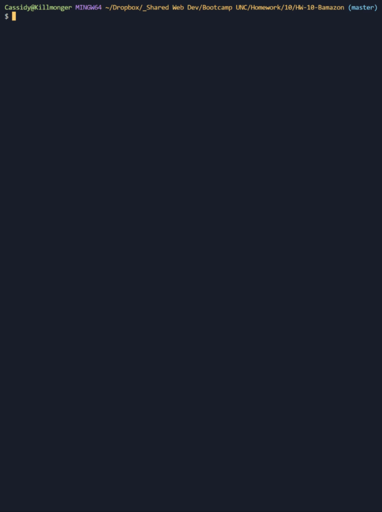
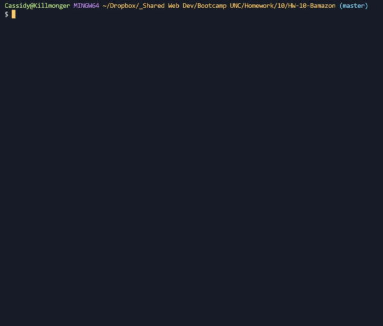

# HW-10-Bamazon
This app allows a Customer to "purchase" items through Bamazon, an online store that doesn't actually exist. Managers are able to add and restock items. Supervisors will be able to add new Departments.

## Install Dependencies
In your terminal, after downloading this repo, install all required node packages with:

```
npm i
```

## Using Bamazon
Bamazon takes 3 different commands:
```
node customer.js
node manager.js
node supervisor.js
```

### customer.js
Here, a Customer can view a list of items available for purchase. They can select an item to purchase and then give the number they would like to buy. If there is enough of that item in stock, they purchase will go through and the database will update. If the inventory is too low, the purchase will be stopped and the Customer can choose a new item.



### manager.js
A Manager can view all products currently available. They can also view any items with an inventory of less than 5. Managers have the option to restock any items, or add new items as well.


### supervisor.js
Supervisors have the options to add new departments to the database, or view all products sales across all departments. They can also see the total profit a department has made.

